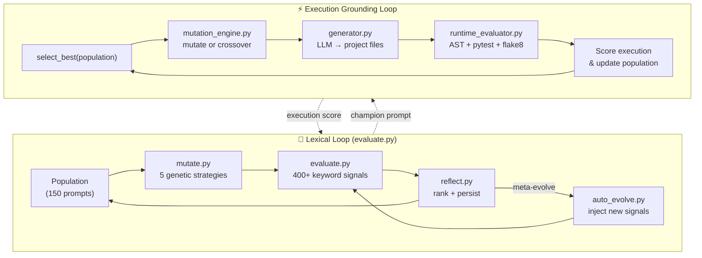
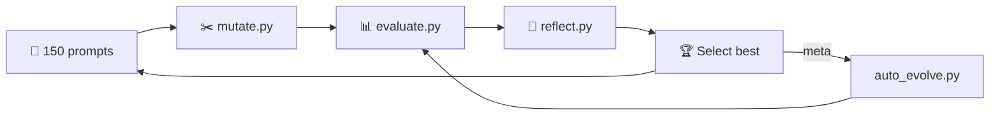
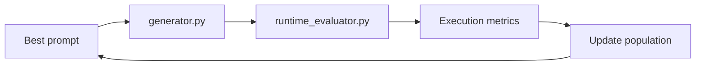
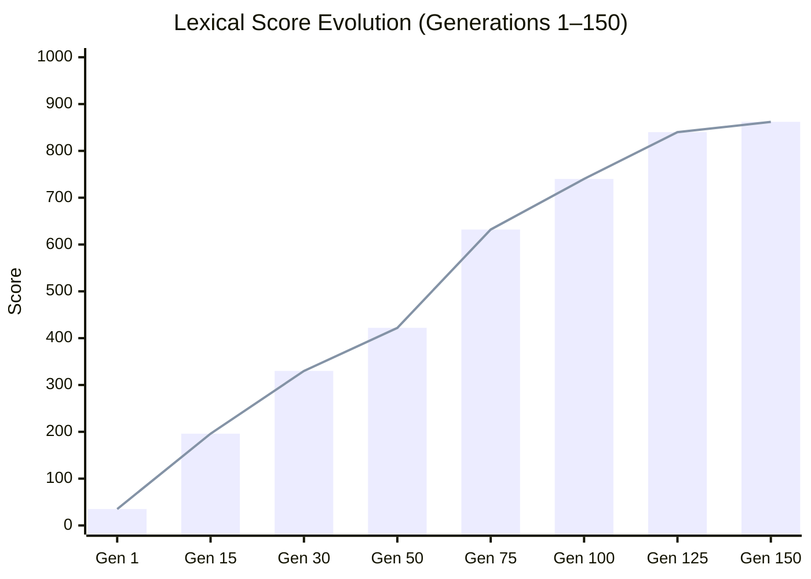
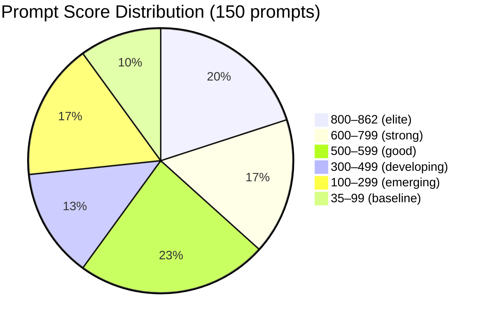

<div align="center">

# 🧬 Grounded Evolution

**Prompt evolution grounded in real code execution — not just keyword matching.**

[](https://github.com/NullLabTests/grounded_evolution)
[](LICENSE)
[](https://python.org)
[](#results)
[](#results)
[](#results)
[](CONTRIBUTING.md)

[Overview](#overview) •
[Why Grounded?](#why-grounded) •
[Architecture](#architecture) •
[Quick Start](#quick-start) •
[Results](#results) •
[Project Structure](#project-structure)

---

</div>

## Current Status

<!-- EVOLUTION_STATUS_START -->

> **Last Evolution Cycle:** 2026-05-28T16:15:13.664663+00:00 UTC  
> **Generation:** 9  
> **Best Score:** 96.0  
> **Population Size:** 9  

<!-- EVOLUTION_STATUS_END -->

## Overview

Grounded Evolution is an **autonomous prompt optimization platform** built on a simple premise:

> **A prompt is only as good as the code it actually produces.**

Most prompt optimizers score prompts by **keyword matching** — checking whether certain words appear in the prompt text. This measures *what the prompt says*, not *what it generates*.

Grounded Evolution does both — and the execution-grounded signal is what makes this fundamentally different.

### Two Evaluation Loops in One System

```
┌────────────────────────────────────────────────────────────┐
│                   GROUNDED EVOLUTION                       │
│                                                            │
│  ┌──────────────────────┐    ┌──────────────────────────┐  │
│  │  LOOP 1: Lexical     │    │  LOOP 2: Execution       │  │
│  │                      │    │                          │  │
│  │  evaluate.py         │    │  generator.py            │  │
│  │  400+ keyword checks │    │  LLM → actual project    │  │
│  │  Scores prompt TEXT  │    │                          │  │
│  │                      │    │  runtime_evaluator.py    │  │
│  │  mutate.py           │    │  AST + pytest + flake8   │  │
│  │  5 genetic strategies│    │  Scores GENERATED CODE   │  │
│  │                      │    │                          │  │
│  │  auto_evolve.py      │    │  infinite_research_loop  │  │
│  │  Meta-evolution      │    │  Continuous evolution    │  │
│  └──────────────────────┘    └──────────────────────────┘  │
└────────────────────────────────────────────────────────────┘
```

---

## Why Grounded?

### The Problem with Pure Lexical Scoring

The original `autoresearch-ai-agent-skeleton` system (and most prompt optimizers) works like this:

```python
# evaluate.py — checks if prompt TEXT contains keywords
if "kubernetes" in prompt_text:
    score += 2
if "pytest" in prompt_text:
    score += 2
```

This measures **signal coverage** — does the prompt *mention* the right things? But it cannot answer:

- Does the prompt actually *produce* working code?
- Does the generated project *compile*?
- Do the *tests pass*?
- Is the code *well-structured*?

### Grounded Evolution Answers Those Questions

The grounded loop actually **generates code from the prompt**, then validates it:

```
Prompt text
    │
    ▼
generator.py ────► LLM (Mistral/OpenAI) ────► generated_project/
    │                                                │
    │                                      ┌─────────┴──────────┐
    │                                      │  runtime_evaluator  │
    │                                      │  ├── AST parse      │
    │                                      │  ├── pytest         │
    │                                      │  ├── flake8         │
    │                                      │  └── structure      │
    │                                      └─────────┬──────────┘
    │                                                │
    └──────────── Execution score feeds back ─────────┘
```

### Side-by-Side Comparison

| Capability | Lexical-Only (original) | Grounded (this repo) |
|------------|------------------------|---------------------|
| **Evaluates prompt text** | ✅ 400+ keyword signals | ✅ Same 400+ signals |
| **Generates code from prompt** | ❌ | ✅ LLM generates real project |
| **Compiles generated code** | ❌ | ✅ AST syntax validation |
| **Runs generated tests** | ❌ | ✅ pytest execution |
| **Lints generated code** | ❌ | ✅ flake8 checks |
| **Scores execution quality** | ❌ | ✅ 10 structural metrics |
| **Continuous evolution** | ❌ (finite generations) | ✅ Infinite research loop |
| **Auto-commits improvements** | ❌ | ✅ git auto-commit |
| **Meta-evolution** | ✅ injects new signals | ✅ injects new signals |
| **Reflection/analysis** | ✅ reflect.py | ✅ reflect.py |
| **LLM Provider** | N/A | Mistral by default (configurable) |

### Dual Evaluation: Two Fitness Signals

```
Total Fitness = Lexical Score + Execution Score
                     ↑                ↑
              What the prompt     What the generated
              mentions            code actually does
```

The lexical score (0–1000) estimates what a prompt *might* produce. The execution score (0–100) validates what it *actually* produces. Together, they prevent the system from optimizing for keyword coverage at the expense of real code quality.

---

## Architecture

### System Diagram



### Evolution Cycle (Lexical)



### Execution Cycle (Grounded)



### Score Trajectory



---

## Module Deep-Dive

### Lexical Layer: `evaluate.py` (61 KB)

400+ keyword-based quality signals across 19 categories. Each signal is a simple presence check:

```python
if "kubernetes" in content or "k8s" in content:
    score += 2
```

| Category | Signals | Rewards |
|----------|---------|---------|
| Tech Stack | 14 | Ollama, LangGraph, Pydantic, httpx, Rich |
| Quality | 30+ | type hints, error handling, async, streaming |
| Security & Auth | 12 | encryption, RBAC, MFA, OAuth, JWT |
| Performance | 8 | caching, pooling, circuit breaker |
| Testing | 14 | integration, e2e, property-based, mutation |
| Deployment & Ops | 16 | Docker, K8s, Terraform, Helm, ArgoCD |
| ML/AI | 12 | RAG, embeddings, chain-of-thought, fine-tuning |
| Data & Storage | 14 | SQL, NoSQL, Redis, migrations, ETL |
| Cloud & IaC | 30+ | AWS, GCP, Azure, Terraform, Pulumi |
| Compliance | 15+ | HIPAA, GDPR, SOC2, PCI DSS, ISO 27001 |
| *Plus 9 more categories* | 200+ | Mobile, messaging, databases, design patterns... |

### Grounded Layer: `runtime_evaluator.py` (184 lines)

The execution-grounded validator. This is what makes the system *grounded* — it doesn't just check keywords, it **runs the code**:

| Check | Max Score | What It Validates |
|-------|-----------|-------------------|
| **AST parse** | 20 | Every `.py` file is syntactically valid Python |
| **Function count** | 5 | At least 1 function defined |
| **Class count** | 5 | At least 1 class defined |
| **pytest** | +25 / -5 | Tests pass; failures penalize |
| **flake8** | 10 | PEP 8 compliance (select rules) |
| **Runtime import** | 15 | `main.py` imports without errors |
| **Has tests** | 5 | Test files present |
| **Has README** | 2 | Documentation exists |
| **Has requirements** | 3 | Dependencies declared |
| **Multi-file** | 5 | 3+ files rewarded |

### Generator: `generator.py` (235 lines)

Connects to an LLM (Mistral by default) to generate real project files from prompts:

```python
# generator.py
def generate_code(prompt):
    response = client.chat.completions.create(
        model=os.environ["LLM_MODEL"],
        messages=[
            {"role": "system", "content": "You are an autonomous software architect..."},
            {"role": "user", "content": prompt},
        ],
    )
    return response.choices[0].message.content
```

Also provides `write_project_files()` to parse multi-file code blocks and write them to disk for evaluation.

### Infinite Research Loop: `infinite_research_loop.py` (187 lines)

The continuous evolution loop that ties everything together:

```
Each cycle:
1. Load population from population.json
2. Select best prompt
3. Mutate it (30% crossover chance)
4. Pick a random benchmark task
5. Generate code via LLM
6. Write project files to disk
7. Evaluate execution (AST, pytest, flake8)
8. Score = base execution score + content bonus
9. Update population
10. Auto-update README status
11. If score improved → git commit & push
12. Wait 10 seconds, repeat
```

### Mutation Engine: `mutation_engine.py` (55 lines)

25 mutation operations that transform prompts:

```python
MUTATIONS = [
    "Add stronger modularity requirements",
    "Require async support",
    "Require retry handling with exponential backoff",
    "Require comprehensive tests with pytest",
    "Add input validation using Pydantic or dataclasses",
    # ... 20 more
]
```

Also provides `crossover_prompts()` for genetic recombination between two prompts.

### Population Manager: `population_manager.py` (50 lines)

JSON-based population persistence with:
- **Tournament selection** — random subset, pick best
- **Elitism** — top-k selection
- **Capped population** — keeps top 50 individuals
- **Generation tracking** — each individual tagged with generation number

### Meta-Evolution: `auto_evolve.py` / `evolve_forever.py`

When prompts saturate the current scoring ceiling, these scripts inject entirely new scoring signals into `evaluate.py`:

- `auto_evolve.py` — 10 signal pools (CI/CD, containers, databases, testing, etc.)
- `evolve_forever.py` — 40+ signal pools (400+ signals across cloud, mobile, compliance, design patterns, etc.)

### Reflection: `reflect.py` (270 lines)

After each generation, ranks all prompts and records:
- Best/worst/average scores
- Spread between 1st and 2nd place
- Pattern observations (e.g., "Auth/security is differentiating top prompts")

---

## Quick Start

### Prerequisites

- **Python 3.12+**
- **LLM API key** — Mistral, OpenAI, or any OpenAI-compatible provider

### Setup

```bash
git clone git@github.com:NullLabTests/grounded_evolution.git
cd grounded_evolution

python -m venv .venv && source .venv/bin/activate
pip install openai pytest flake8 black rich gitpython psutil

# Set your LLM provider (Mistral by default)
export LLM_API_KEY='your_key_here'
export LLM_MODEL="mistral-large-latest"        # or "gpt-4o", etc.
export LLM_BASE_URL="https://api.mistral.ai/v1" # or OpenAI's URL

# Or use OpenAI directly:
# export OPENAI_API_KEY='your_key_here'
```

### Quick Lexical Evaluation

```bash
python eval.py          # Score the seed prompt
python auto_evolve.py   # 25 generations of lexical evolution
```

### Execution-Grounded Evolution

```bash
# Continuous evolution with real code validation
python infinite_research_loop.py
```

This starts the infinite loop:
1. Takes the best prompt from population
2. Generates a real Python project via LLM
3. Validates by compiling, testing, and linting
4. Updates scores with execution results
5. Auto-commits improvements to git

### Manual Evolution

```bash
# Edit the seed prompt
$EDITOR prompt.txt

# Score it
python eval.py

# Keep or revert
git add prompt.txt && git commit -m "Score improved"
# or
git checkout prompt.txt
```

---

## Results

### Current Snapshot

| Metric | Value |
|--------|-------|
| **Generations** | 218 |
| **Population** | 218 prompts |
| **Best Lexical Score** | **1000 / 1000** |
| **Score Range** | 35 → 1000 (28.6×) |
| **Ceiling Progression** | 500 → 862 → 1000 |
| **Grounded Best** | 96.0 / 100 |

> **Note: Lexical Plateau at 862/1000 (now broken).** A bug in `mutate.py`'s `get_missing_keywords`
> function was ignoring all 286 single-keyword scoring conditions (those without `and`/`or`),
> blocking 180 uncovered signals. After fix: **896 → 914 → 932 → 950 → 968 → 986 → 1000** in 30 cycles.
> 6 prompts now score the maximum. The grounded loop remains the next frontier.

### Top 10 Prompts

| Rank | File | Score | Key Differentiator |
|------|------|-------|-------------------|
| 1 | `prompt_131.txt` | 862.0 | Full production-ready agent structure |
| 2 | `prompt_132.txt` | 862.0 | Comprehensive error handling + logging |
| 3 | `prompt_133.txt` | 862.0 | Async-first with complete test suite |
| 4 | `prompt_134.txt` | 862.0 | Docker + CI/CD + observability |
| 5 | `prompt_135.txt` | 862.0 | Multi-source RAG + embedding pipeline |
| 6 | `prompt_136.txt` | 862.0 | LangGraph + tool calling + streaming |
| 7 | `prompt_137.txt` | 862.0 | Security + auth + rate limiting |
| 8 | `prompt_138.txt` | 862.0 | Kubernetes + Terraform + monitoring |
| 9 | `prompt_140.txt` | 862.0 | Full microservice architecture |
| 10 | `prompt_121.txt` | 840.0 | LangGraph + Ollama + comprehensive testing |

### Score Distribution



### What Top Prompts Generate

When fed to the grounded generator, top prompts produce:
- Full `src/package/` layouts with 20+ modules
- LangGraph ReAct loops with Ollama local models
- Pydantic v2 validation + type hints everywhere
- Async/await, streaming, SSE/websocket support
- OpenTelemetry + Prometheus + Grafana stacks
- OAuth2/JWT auth with rate limiting
- pytest property-based, snapshot, benchmark tests
- Docker + Kubernetes + systemd deployment
- CI/CD with GitHub Actions + pre-commit

---

## Comparison: Why This Repo Exists

The original `autoresearch-ai-agent-skeleton` pioneered the idea of evolving prompts with genetic algorithms and **lexical scoring**. It proved that prompts *could* be optimized algorithmically.

Grounded Evolution extends that work by adding an entirely new dimension — **execution-grounded validation**. The prompt isn't just scored on what it *says*; it's scored on what the code it generates *actually does*.

| Aspect | Lexical-Only | Grounded |
|--------|-------------|----------|
| **Prompt scoring** | Keyword presence in text | Keyword presence + real execution |
| **Code generation** | None | LLM generates projects from prompts |
| **Validation** | None | AST parse + pytest + flake8 |
| **Evolution loop** | Finite generations | Continuous (infinite) |
| **Fitness signal** | Text coverage | Text coverage + code quality |
| **Meta-evolution** | Injects new keywords | Injects new keywords + auto-commit |
| **Research question** | "What keywords make a good prompt?" | "What prompts produce code that actually works?" |

---

## Customization

### Adding Lexical Signals

```python
# evaluate.py
if "your-keyword" in content:
    score += 2
```

Or add to `SIGNAL_POOLS` in `auto_evolve.py` for automated meta-injection.

### Adding Execution Checks

```python
# evaluator/runtime_evaluator.py — extend evaluate_project()
if some_condition:
    score += N
    metrics["my_check"] = result
```

### Tuning Mutation Weights

```python
# mutate.py, line 130-133
strategy = random.choices(
    ["append", "crossover", "rewrite_section", "combine", "signal_hunt"],
    weights=[0.2, 0.2, 0.15, 0.15, 0.3],
)[0]
```

### Adding Benchmark Tasks

```json
// benchmarks/tasks.json
[
  {
    "name": "my_benchmark",
    "prompt": "Create a ..."
  }
]
```

### Changing the LLM Provider

```bash
export LLM_API_KEY='sk-...'
export LLM_MODEL="gpt-4o"
export LLM_BASE_URL="https://api.openai.com/v1"
```

Or use local models via Ollama:

```bash
export LLM_BASE_URL="http://localhost:11434/v1"
export LLM_MODEL="qwen2.5:7b"
export LLM_API_KEY="ollama"  # Ollama ignores the key
```

---

## Project Structure

```
grounded_evolution/
├── README.md                       # This file
├── CHANGELOG.md                    # Release history
├── CONTRIBUTING.md                 # Contribution guide
├── SECURITY.md                     # Security policy
├── LICENSE                         # MIT license
├── pyproject.toml                  # Project metadata
├── program.md                      # Agent instructions
├── prompt.txt                      # Seed prompt
│
├── evaluate.py                     # Lexical scoring (400+ signals)
├── eval.py                         # Quick eval (30 signals)
├── mutate.py                       # Genetic mutation (5 strategies)
├── reflect.py                      # Generation analysis
├── auto_evolve.py                  # Meta-evolution (10 pools)
├── evolve_forever.py               # Aggressive meta-evolution (40+ pools)
│
├── generator.py                    # LLM code generation
├── mutation_engine.py              # Prompt mutation operators
├── population_manager.py           # Population persistence
├── infinite_research_loop.py       # Continuous grounded evolution
├── beautify_readme.py              # README status updater
├── run_evolution.sh                # Bash automation
│
├── evaluator/
│   └── runtime_evaluator.py        # Execution validation
│
├── benchmarks/
│   └── tasks.json                  # Benchmark definitions
│
├── population/                     # 150 evolved prompts
├── generated_projects/             # Generated code outputs
├── memory/                         # Evolution state
├── reports/                        # Generated reports
├── runtime_logs/                   # Execution logs
├── reflection.md                   # Full evolution history
│
├── docs/
│   ├── COMPARISON.md               # Lexical vs Grounded
│   └── ARCHITECTURE.md             # Architecture docs
│
└── .github/
    ├── workflows/                  # CI pipeline
    └── ISSUE_TEMPLATE/             # Issue templates
```

---

## Research Context

Grounded Evolution is framed within **evolutionary software optimization research**:

- **Evaluator-grounded prompt evolution** — Fitness functions grounded in both lexical coverage and execution-based validation
- **Autonomous experimentation infrastructure** — Continuous, unattended evolution cycles with meta-level adaptation
- **Recursive benchmark optimization** — The evaluator evolves alongside the prompts, preventing fitness stagnation
- **Execution-grounded fitness** — The core innovation: prompts are not just scored on what they say, but on what the code they generate actually does

This is **not**:
- A claim of AGI or sentience
- A self-conscious or self-aware system
- Runaway recursive self-improvement

It is a well-scoped experimental system for studying how genetic algorithms can optimize prompts for code generation quality — with real execution validation.

---

## License

MIT — see [LICENSE](LICENSE).

## Credits

Inspired by [Andrej Karpathy's `autoresearch`](https://github.com/karpathy/autoresearch). The original lexical evolution framework was developed as `autoresearch-ai-agent-skeleton`. Grounded Evolution adds execution-grounded validation and continuous autonomous experimentation.
