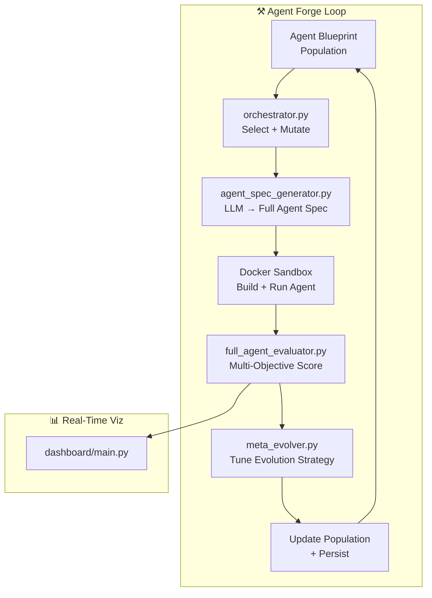

<div align="center">

# ⚒️ Grounded Agent Forge

**Evolving full agent blueprints through execution-grounded genetic algorithms — not just prompts, but tools, memory, planning, and self-evaluation.**

[](https://github.com/NullLabTests/grounded_agent_forge)
[](LICENSE)
[](https://python.org)
[](#)
[](https://deepseek.com)
[](CONTRIBUTING.md)
[](#research-context)

[Overview](#overview) •
[Project Lineage](#project-lineage) •
[Architecture](#architecture) •
[Quick Start](#quick-start) •
[Modules](#modules) •
[Project Structure](#project-structure)

---

</div>

## Overview

Grounded Agent Forge is the **next evolution** of execution-grounded prompt optimization. Where the original [grounded_evolution](https://github.com/NullLabTests/grounded_evolution) evolved text prompts to generate better code, **this project evolves complete agent blueprints** — full specifications for autonomous AI agents including system prompts, tool definitions, memory architectures, planning strategies, and self-evaluation mechanisms.

### What Makes This Different

- **Agent-Level Evolution** — Not just prompts, but entire agent architectures evolve through genetic algorithms
- **Docker Sandboxing** — Every generated agent is executed in an isolated container; real execution metrics drive the fitness function
- **Multi-Objective Fitness** — Agents are scored on correctness, efficiency, tool-use accuracy, planning depth, and self-evaluation quality
- **Meta-Evolution** — The evolutionary strategy itself evolves: crossover rates, mutation operators, and selection pressure adapt over time
- **Task Specialization** — Populations diversify into specialist agents for different problem domains
- **Dashboard** — Real-time web dashboard to visualize evolution progress, agent scores, and population dynamics

---

## Project Lineage

```
┌──────────────────────────────────────────────────────────────┐
│                  grounded_agent_forge (THIS)                  │
│  Evolves full agent blueprints (prompt + tools + memory +    │
│  planning + self-eval) in Docker sandbox with multi-objective │
│  fitness, meta-evolution, and task specialization.            │
└──────────────────────────────────────────────────────────────┘
                              ▲
                              │ builds on
┌──────────────────────────────────────────────────────────────┐
│                  grounded_evolution (ancestor)                 │
│  Evolves text prompts with execution-grounded validation via  │
│  AST parse, pytest, and flake8. Two-loop system: lexical +   │
│  grounded. Achieved 203 cycles, best score 39/80.             │
└──────────────────────────────────────────────────────────────┘
                              ▲
                              │ builds on
┌──────────────────────────────────────────────────────────────┐
│           autoresearch-ai-agent-skeleton (original)           │
│  Lexical-only prompt evolution with 400+ keyword signals,     │
│  5 genetic strategies, meta-signal injection.                 │
└──────────────────────────────────────────────────────────────┘
```

### Capability Comparison

| Capability | Lexical-Only | Grounded Evolution | Grounded Agent Forge |
|------------|:---:|:---:|:---:|
| **Keyword prompt scoring** | ✅ 400+ signals | ✅ 400+ signals | ✅ 400+ signals |
| **Execution-grounded validation** | ❌ | ✅ AST + pytest + flake8 | ✅ Full Docker sandbox |
| **Evolves prompts** | ✅ | ✅ | ✅ |
| **Evolves agent blueprints** | ❌ | ❌ | ✅ |
| **Docker sandbox isolation** | ❌ | ❌ | ✅ |
| **Multi-objective fitness** | ❌ | ❌ | ✅ (8+ fitness dimensions) |
| **Meta-evolution** | ✅ signal injection | ✅ signal injection | ✅ full strategy evolution |
| **Task specialization** | ❌ | ❌ | ✅ |
| **Real-time dashboard** | ❌ | ❌ | ✅ |
| **Self-evaluation in agents** | ❌ | ❌ | ✅ |
| **Tool-use validation** | ❌ | ❌ | ✅ |
| **Planning depth scoring** | ❌ | ❌ | ✅ |
| **Infinite research loop** | ❌ (finite) | ✅ | ✅ |
| **Auto-commit on improvement** | ❌ | ✅ | ✅ |

> **This project was built using DeepSeek V4 as the primary coding model.**

---

## Architecture

### High-Level System Design

```
┌─────────────────────────────────────────────────────────────────┐
│                    GROUNDED AGENT FORGE                          │
│                                                                  │
│  ┌─────────────────────┐    ┌────────────────────────────────┐   │
│  │  orchetrator.py     │───▶│  agent_spec_generator.py       │   │
│  │  Main evolution     │    │  Generates agent blueprints    │   │
│  │  loop coordinator   │    │  from evolved specifications   │   │
│  └──────────┬──────────┘    └──────────────┬─────────────────┘   │
│             │                              │                     │
│             ▼                              ▼                     │
│  ┌─────────────────────┐    ┌────────────────────────────────┐   │
│  │  full_agent_        │    │  Docker Sandbox                │   │
│  │  evaluator.py       │───▶│  - Isolated execution env      │   │
│  │  Multi-objective    │    │  - Tool-use validation         │   │
│  │  fitness scoring    │    │  - Planning evaluation         │   │
│  └──────────┬──────────┘    └────────────────────────────────┘   │
│             │                                                     │
│             ▼                                                     │
│  ┌─────────────────────┐                                          │
│  │  meta_evolver.py    │───▶ Self-tuning evolution strategy       │
│  │  Strategy adaptation│                                          │
│  └─────────────────────┘                                          │
│                                                                  │
│  ┌─────────────────────┐                                          │
│  │  dashboard/         │───▶ Real-time evolution visualization   │
│  │  main.py            │                                          │
│  └─────────────────────┘                                          │
└─────────────────────────────────────────────────────────────────┘
```

### Evolution Cycle



### Multi-Objective Fitness Dimensions

| Dimension | Weight | What It Measures |
|-----------|--------|-----------------|
| **Correctness** | 30% | Does the agent solve the task correctly? |
| **Tool-Use Accuracy** | 15% | Does the agent call tools with valid arguments? |
| **Planning Depth** | 15% | Does the agent decompose problems into steps? |
| **Code Quality** | 10% | AST validity, structure, linting |
| **Memory Effectiveness** | 10% | Does the agent use memory to maintain context? |
| **Self-Evaluation** | 10% | Does the agent correctly assess its own outputs? |
| **Efficiency** | 5% | Token efficiency, round-trips to completion |
| **Prompt Quality** | 5% | Lexical signal coverage (legacy metric) |

---

## Quick Start

### Prerequisites

- **Python 3.12+**
- **Docker** (for sandboxed agent execution)
- **LLM API key** — DeepSeek, OpenAI, or any OpenAI-compatible provider

### Setup

```bash
git clone git@github.com:NullLabTests/grounded_agent_forge.git
cd grounded_agent_forge

python -m venv .venv && source .venv/bin/activate

# Install base dependencies
pip install -e .

# Install forge extras (Docker sandbox, dashboard, etc.)
pip install -e ".[forge]"

# Set your LLM provider
export LLM_API_KEY='your_key_here'
export LLM_MODEL="deepseek-chat"             # or "gpt-4o", "mistral-large", etc.
export LLM_BASE_URL="https://api.deepseek.com/v1"
```

### Run the Forge

```bash
# Start the infinite agent evolution loop
python -m agent_forge.orchestrator

# Or use the shell wrapper
bash run_forge_loop.sh
```

### Launch the Dashboard

```bash
uvicorn dashboard.main:app --reload --port 8000
# Open http://localhost:8000 in your browser
```

### Configuration

Set these environment variables or add them to `.env`:

| Variable | Default | Description |
|----------|---------|-------------|
| `LLM_API_KEY` | — | LLM provider API key |
| `LLM_MODEL` | `deepseek-chat` | Model name |
| `LLM_BASE_URL` | `https://api.deepseek.com/v1` | API endpoint |
| `FORGE_DB_URL` | `sqlite+aiosqlite:///forge_population.db` | Population database |
| `SANDBOX_TIMEOUT` | `300` | Docker sandbox timeout (seconds) |
| `MAX_PARALLEL_GENERATIONS` | `3` | Concurrent agent generations |
| `HUMAN_APPROVAL` | `false` | Require manual approval before execution |
| `DASHBOARD_PORT` | `8000` | Dashboard server port |

---

## Modules

### `agent_forge/orchestrator.py`

The central evolution loop coordinator. Responsible for:
- Loading/persisting the agent blueprint population
- Selection, crossover, and mutation scheduling
- Parallel generation management
- Fitness tracking and convergence detection

### `agent_forge/agent_spec_generator.py`

Generates full agent specifications from evolved blueprints. An agent spec includes:
- **System prompt** — Core identity and behavior instructions
- **Tool definitions** — Function schemas the agent can call
- **Memory architecture** — Short-term, long-term, and working memory configuration
- **Planning strategy** — Chain-of-thought, ReAct, or tree-of-thought config
- **Self-evaluation criteria** — How the agent judges its own outputs

### `agent_forge/full_agent_evaluator.py`

Multi-objective fitness evaluator that:
- Builds a Docker container from the agent spec
- Executes the agent against benchmark tasks
- Scores across 8+ fitness dimensions (correctness, tool-use, planning, etc.)
- Logs detailed per-dimension metrics for analysis
- Handles sandbox timeouts and failures gracefully

### `agent_forge/meta_evolver.py`

Evolution strategy optimizer that:
- Tracks which mutation/crossover operators produce the best fitness gains
- Adjusts operator probabilities in real-time (self-tuning weights)
- Evolves the evolution strategy itself (meta-level adaptation)
- Detects stagnation and introduces novelty-driven exploration
- Persists strategy state across runs

### `dashboard/main.py`

FastAPI-based web dashboard providing:
- Real-time population visualization
- Fitness trajectory charts
- Agent blueprint comparison views
- Per-dimension score breakdowns
- Evolution control (pause/resume/manual trigger)

---

## Project Structure

```
grounded_agent_forge/
├── README.md                       # This file
├── LICENSE                         # MIT license
├── pyproject.toml                  # Project metadata
├── AGENTS.md                       # Agent collaboration conventions
├── .env.example                    # Environment configuration template
│
├── agent_forge/                    # Core forge modules
│   ├── __init__.py
│   ├── orchestrator.py             # Evolution loop coordinator
│   ├── agent_spec_generator.py     # Agent blueprint generator
│   ├── full_agent_evaluator.py     # Multi-objective fitness evaluator
│   └── meta_evolver.py             # Strategy adaptation
│
├── dashboard/                      # Real-time web dashboard
│   └── main.py                     # FastAPI app
│
├── run_forge_loop.sh               # Bash automation wrapper
│
├── .github/                        # CI and templates
├── docs/                           # Documentation
├── experiments/                    # Experiment outputs
├── benchmarks/                     # Task definitions
├── evaluator/                      # (legacy) Grounded evolution evaluator
├── population/                     # (legacy) Evolved prompts
├── memory/                         # Evolution state
├── analysis/                       # Visualization scripts
├── generator.py                    # (legacy) LLM code generation
├── infinite_research_loop.py       # (legacy) Grounded evolution loop
├── mutation_engine.py              # (legacy) Prompt mutation operators
└── population_manager.py           # (legacy) Population persistence
```

> **Note**: Modules marked "(legacy)" are carried forward from grounded_evolution. They remain functional but the primary development focus is on `agent_forge/`.

---

## Research Context

Grounded Agent Forge is framed within **evolutionary software optimization research**:

- **Blueprint-level evolution** — Moving from prompt text evolution to full agent architecture evolution
- **Execution-grounded multi-objective fitness** — Real Docker sandbox execution across 8+ fitness dimensions
- **Meta-evolutionary adaptation** — The evolutionary strategy itself evolves, preventing stagnation
- **Task specialization** — Populations naturally diversify into domain-specific agent archetypes
- **Self-evaluating agents** — Agents that can assess their own output quality are rewarded

This is **not**:
- A claim of AGI or sentience
- A self-conscious or self-aware system
- Runaway recursive self-improvement

It is a well-scoped experimental system for studying how genetic algorithms can evolve complete agent architectures — with real execution validation in isolated sandboxes.

---

## License

MIT — see [LICENSE](LICENSE).

## Credits

- **Predecessor**: [grounded_evolution](https://github.com/NullLabTests/grounded_evolution) — execution-grounded prompt evolution platform
- **Original**: [autoresearch-ai-agent-skeleton](https://github.com/karpathy/autoresearch) — lexical prompt evolution (inspired by Andrej Karpathy's work)
- **Built using**: DeepSeek V4 as the primary coding model for this project
