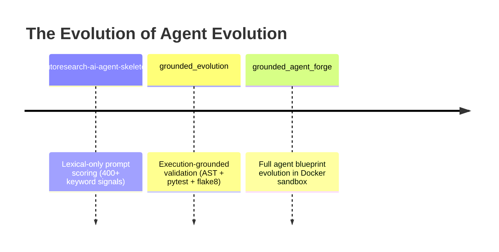
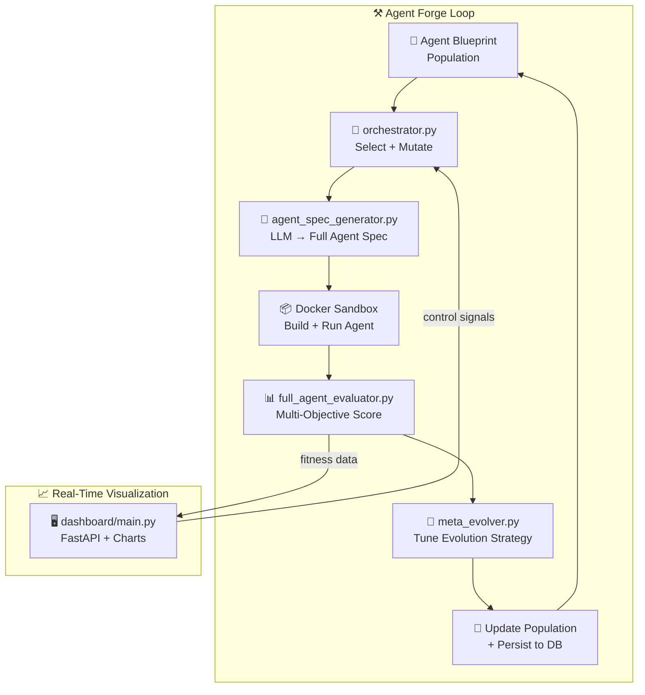
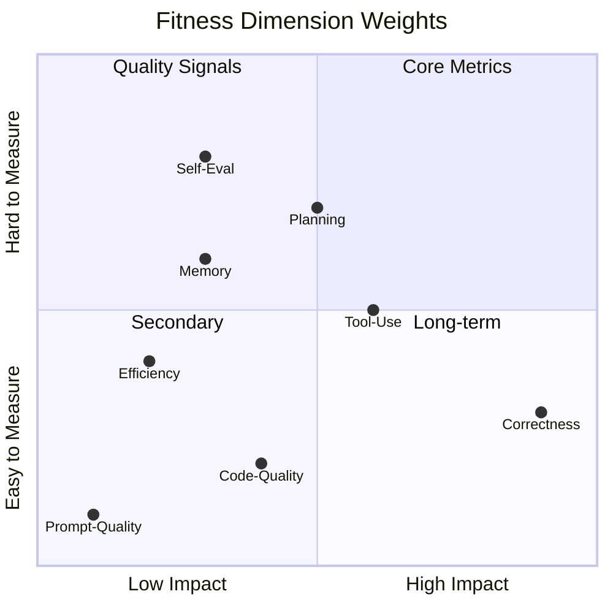
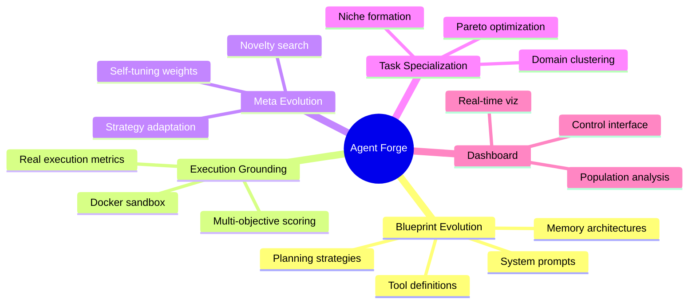

<div align="center">

# ⚒️ Grounded Agent Forge

**Evolving full agent blueprints through execution-grounded genetic algorithms — not just prompts, but tools, memory, planning, and self-evaluation.**

[](https://github.com/NullLabTests/grounded_agent_forge)
[](LICENSE)
[](https://python.org)
[](https://docker.com)
[](#launch-the-dashboard)
[](https://sqlalchemy.org)
[](https://docs.astral.sh/ruff/)

[](https://deepseek.com)
[](CONTRIBUTING.md)
[](#research-context)
[](https://github.com/NullLabTests/grounded_agent_forge)
[](https://github.com/NullLabTests/grounded_agent_forge)
[](https://github.com/NullLabTests/grounded_agent_forge)
[](#setup)
[](https://x.com/NullLabTests)

---

**Navigation** · [Overview](#overview) · [Project Lineage](#project-lineage) · [Architecture](#architecture) · [Quick Start](#quick-start) · [Modules](#modules) · [Project Structure](#project-structure) · [Research](#research-context) · [Contributing](#contributing)

---

</div>

## ✦ Overview

Grounded Agent Forge is the **next evolution** of execution-grounded prompt optimization. Where the original [grounded_evolution](https://github.com/NullLabTests/grounded_evolution) evolved text prompts to generate better code, **this project evolves complete agent blueprints** — full specifications for autonomous AI agents including system prompts, tool definitions, memory architectures, planning strategies, and self-evaluation mechanisms.



### What Makes This Different

| Feature | Impact |
|---------|--------|
| 🧬 **Agent-Level Evolution** | Not just prompts — entire agent architectures evolve through genetic algorithms |
| 📦 **Docker Sandboxing** | Every generated agent executes in an isolated container; real execution metrics drive fitness |
| 🎯 **Multi-Objective Fitness** | Agents scored on correctness, efficiency, tool-use accuracy, planning depth, and self-evaluation |
| 🔄 **Meta-Evolution** | The evolutionary strategy itself evolves: crossover rates, mutation operators, and selection pressure adapt over time |
| 🧩 **Task Specialization** | Populations diversify into specialist agents for different problem domains |
| 📊 **Real-Time Dashboard** | Web-based visualization of evolution progress, agent scores, and population dynamics |

---

## 🧬 Project Lineage

```
┌──────────────────────────────────────────────────────────────────┐
│                     grounded_agent_forge                          │
│                         (THIS REPO)                               │
│  Evolves full agent blueprints (prompt + tools + memory +         │
│  planning + self-eval) in Docker sandbox with multi-objective     │
│  fitness, meta-evolution, and task specialization.                 │
│                                                                    │
│  🏗️ Agent-level evolution    📦 Docker sandboxed execution         │
│  🎯 8+ fitness dimensions    🔄 Self-tuning meta-evolution         │
│  📊 Real-time dashboard      🧩 Task specialization                │
└──────────────────────────────────────────────────────────────────┘
                              ▲
                              │ builds on · evolves from
┌──────────────────────────────────────────────────────────────────┐
│                      grounded_evolution                           │
│                   (github.com/NullLabTests/grounded_evolution)    │
│  Evolves text prompts with execution-grounded validation via AST  │
│  parse, pytest, and flake8. Two-loop system: lexical + grounded.  │
│                                                                    │
│  📝 203 evolution cycles    🏆 Best score: 39/80                   │
│  🔬 7 benchmark tasks       🔄 127 mutations + 76 crossovers       │
└──────────────────────────────────────────────────────────────────┘
                              ▲
                              │ builds on · evolves from
┌──────────────────────────────────────────────────────────────────┐
│                  autoresearch-ai-agent-skeleton                    │
│  Lexical-only prompt evolution with 400+ keyword signals across   │
│  19 categories. 5 genetic mutation strategies. Meta-signal        │
│  injection via auto_evolve.py.                                     │
│                                                                    │
│  📝 218 prompts evolved     🏆 Best lexical score: 1000/1000       │
│  🔤 400+ keyword signals    🧬 5 mutation strategies               │
└──────────────────────────────────────────────────────────────────┘
```

### Capability Comparison

| Capability | Lexical-Only | Grounded Evolution | 🚀 Grounded Agent Forge |
|------------|:---:|:---:|:---:|
| **Keyword prompt scoring** | ✅ 400+ signals | ✅ 400+ signals | ✅ 400+ signals |
| **Execution-grounded validation** | ❌ | ✅ AST + pytest + flake8 | ✅ Full Docker sandbox |
| **Evolves prompts** | ✅ | ✅ | ✅ |
| **Evolves agent blueprints** | ❌ | ❌ | ✅ |
| **Docker sandbox isolation** | ❌ | ❌ | ✅ |
| **Multi-objective fitness** | ❌ | ❌ | ✅ (8+ dimensions) |
| **Meta-evolution** | ✅ signal injection | ✅ signal injection | ✅ full strategy evolution |
| **Task specialization** | ❌ | ❌ | ✅ |
| **Real-time dashboard** | ❌ | ❌ | ✅ |
| **Self-evaluation in agents** | ❌ | ❌ | ✅ |
| **Tool-use validation** | ❌ | ❌ | ✅ |
| **Planning depth scoring** | ❌ | ❌ | ✅ |
| **Infinite research loop** | ❌ (finite) | ✅ | ✅ |
| **Auto-commit on improvement** | ❌ | ✅ | ✅ |

> **This project was built using DeepSeek V4 as the primary coding model.**

---

## 🏗️ Architecture

### High-Level System Design

```
┌──────────────────────────────────────────────────────────────────────┐
│                       GROUNDED AGENT FORGE                            │
│                                                                       │
│  ┌──────────────────────────┐    ┌────────────────────────────────┐   │
│  │    orchestrator.py       │───▶│   agent_spec_generator.py      │   │
│  │  ─ Main evolution loop   │    │  ─ Generates agent blueprints  │   │
│  │  ─ Selection & mutation   │    │  ─ System prompt + tools       │   │
│  │  ─ Parallel generation   │    │  ─ Memory + planning config    │   │
│  └───────────┬──────────────┘    └───────────────┬────────────────┘   │
│              │                                    │                    │
│              ▼                                    ▼                    │
│  ┌──────────────────────────┐    ┌────────────────────────────────┐   │
│  │   full_agent_evaluator   │    │        Docker Sandbox          │   │
│  │  ─ Multi-objective score │───▶│  ─ Isolated container exec     │   │
│  │  ─ 8 fitness dimensions  │    │  ─ Tool-use validation         │   │
│  │  ─ Benchmark execution   │    │  ─ Planning evaluation         │   │
│  └───────────┬──────────────┘    └────────────────────────────────┘   │
│              │                                                         │
│              ▼                                                         │
│  ┌──────────────────────────┐                                          │
│  │      meta_evolver.py     │───▶ Self-tuning evolution strategy       │
│  │  ─ Adaptive mutation     │                                          │
│  │  ─ Weight optimization   │                                          │
│  │  ─ Novelty-driven explore│                                          │
│  └──────────────────────────┘                                          │
│                                                                       │
│  ┌──────────────────────────┐                                          │
│  │      dashboard/          │───▶ Real-time evolution visualization   │
│  │      main.py             │     (FastAPI + Web UI)                   │
│  └──────────────────────────┘                                          │
└──────────────────────────────────────────────────────────────────────┘
```

### Evolution Cycle



### Multi-Objective Fitness Dimensions



| Dimension | Weight | What It Measures |
|-----------|:-----:|------------------|
| 🎯 **Correctness** | 30% | Does the agent solve the task correctly? |
| 🔧 **Tool-Use Accuracy** | 15% | Does the agent call tools with valid arguments? |
| 🧩 **Planning Depth** | 15% | Does the agent decompose problems into steps? |
| 📝 **Code Quality** | 10% | AST validity, project structure, linting |
| 🧠 **Memory Effectiveness** | 10% | Does the agent use memory to maintain context? |
| 🔍 **Self-Evaluation** | 10% | Does the agent correctly assess its own outputs? |
| ⚡ **Efficiency** | 5% | Token efficiency, round-trips to completion |
| 📖 **Prompt Quality** | 5% | Lexical signal coverage (legacy metric) |

---

## 🚀 Quick Start

### Prerequisites

- **Python 3.12+**
- **Docker** (for sandboxed agent execution)
- **LLM API key** — DeepSeek, OpenAI, or any OpenAI-compatible provider

### Setup

```bash
# Clone the repository
git clone git@github.com:NullLabTests/grounded_agent_forge.git
cd grounded_agent_forge

# Create virtual environment
python -m venv .venv && source .venv/bin/activate

# Install base + forge extras
pip install -e ".[forge]"

# Configure your LLM provider
cp .env.example .env
# Edit .env with your API key and model preferences
```

### Run the Forge

```bash
# Start the infinite agent evolution loop (two ways):
python -m agent_forge.orchestrator

# OR use the shell wrapper:
bash run_forge_loop.sh
```

### Launch the Dashboard

```bash
uvicorn dashboard.main:app --reload --port 8000
# Open → http://localhost:8000
```

### Configuration

| Variable | Default | Description |
|----------|---------|-------------|
| `LLM_API_KEY` | — | LLM provider API key |
| `LLM_MODEL` | `deepseek-chat` | Model name |
| `LLM_BASE_URL` | `https://api.deepseek.com/v1` | API endpoint |
| `FORGE_DB_URL` | `sqlite+aiosqlite:///forge_population.db` | Population database |
| `SANDBOX_TIMEOUT` | `300` | Docker sandbox timeout (seconds) |
| `MAX_PARALLEL_GENERATIONS` | `3` | Concurrent agent generations |
| `HUMAN_APPROVAL` | `false` | Require manual approval before execution |
| `DASHBOARD_PORT` | `8000` | Dashboard server port |

---

## 📦 Modules

### ⚒️ `agent_forge/orchestrator.py`

The central evolution loop coordinator — the brain of the forge.

```
┌──────────────────────────────────────┐
│         orchestrator.py              │
│                                      │
│  ┌─────────┐  ┌──────────┐  ┌─────┐ │
│  │ Load    │─▶│ Select   │─▶│ Mu- │ │
│  │ pop     │  │ champion │  │ tate│ │
│  └─────────┘  └──────────┘  └──┬──┘ │
│                                 ▼    │
│  ┌─────────┐  ┌──────────┐  ┌─────┐ │
│  │ Per-    │◀─│ Track    │◀─│ Eval│ │
│  │ sist    │  │ fitness  │  │ uate│ │
│  └─────────┘  └──────────┘  └─────┘ │
└──────────────────────────────────────┘
```

- Loads/persists agent blueprint population from database
- Tournament selection with elitism
- Mutation and crossover scheduling
- Parallel generation management
- Fitness tracking and convergence detection

### 🤖 `agent_forge/agent_spec_generator.py`

Generates full agent specifications from evolved blueprints. An agent spec includes:

| Component | Description |
|-----------|-------------|
| 🧠 **System Prompt** | Core identity, behavior instructions, and constraints |
| 🛠️ **Tool Definitions** | Function schemas the agent can call (JSON schema) |
| 💾 **Memory Architecture** | Short-term, long-term, and working memory configuration |
| 🗺️ **Planning Strategy** | Chain-of-thought, ReAct, or tree-of-thought configuration |
| 🔍 **Self-Evaluation Criteria** | How the agent judges its own outputs |
| 📐 **Output Schema** | Expected response format and structure |

### 📊 `agent_forge/full_agent_evaluator.py`

Multi-objective fitness evaluator — the forge's quality gate.

```
Agent Spec
    │
    ▼
┌─────────────────────────────┐
│  Build Docker Container     │
│  └─ Install dependencies   │
│  └─ Configure environment  │
└──────────┬──────────────────┘
           ▼
┌─────────────────────────────┐
│  Execute Against Benchmarks │
│  └─ Task completion check  │
│  └─ Tool call validation   │
│  └─ Planning analysis      │
└──────────┬──────────────────┘
           ▼
┌─────────────────────────────┐
│  Score Across 8 Dimensions  │
│  └─ Correctness (30%)      │
│  └─ Tool-Use (15%)         │
│  └─ Planning (15%)         │
│  └─ + 5 more metrics       │
└─────────────────────────────┘
```

- Builds Docker containers from agent specs
- Executes agents against benchmark tasks
- Scores across 8+ fitness dimensions
- Handles sandbox timeouts and failures gracefully
- Logs detailed per-dimension metrics

### 🧠 `agent_forge/meta_evolver.py`

Evolution strategy optimizer — the forge that forges itself.

```
┌──────────────────────────────────┐
│         meta_evolver.py          │
│                                  │
│  Input: population fitness deltas│
│                                  │
│  ┌────────────────────────────┐ │
│  │ Track operator success     │ │
│  │ per operator               │ │
│  └──────────┬─────────────────┘ │
│             ▼                    │
│  ┌────────────────────────────┐ │
│  │ Adjust probabilities       │ │
│  │ up-weight winners          │ │
│  │ down-weight losers         │ │
│  └──────────┬─────────────────┘ │
│             ▼                    │
│  ┌────────────────────────────┐ │
│  │ Detect stagnation          │ │
│  │ if flat → novelty search   │ │
│  └──────────┬─────────────────┘ │
│             ▼                    │
│  Output: new evolution config   │
└──────────────────────────────────┘
```

- Tracks which mutation/crossover operators produce the best fitness gains
- Adjusts operator probabilities in real-time (self-tuning weights)
- Evolves the evolution strategy itself (meta-level adaptation)
- Detects stagnation and introduces novelty-driven exploration
- Persists strategy state across runs

### 📈 `dashboard/main.py`

FastAPI-based web dashboard providing:

| Feature | Description |
|---------|-------------|
| 📊 **Population View** | Real-time visualization of the agent population |
| 📈 **Fitness Trajectory** | Score over time across all dimensions |
| 🔍 **Agent Inspector** | Compare blueprint specs side-by-side |
| 🎯 **Dimension Breakdown** | Per-dimension score distribution |
| 🎮 **Evolution Controls** | Pause, resume, and manual trigger |

---

## 📁 Project Structure

```
grounded_agent_forge/
├── README.md                         # This file
├── LICENSE                           # MIT license
├── pyproject.toml                    # Project metadata + dependencies
├── AGENTS.md                         # Agent collaboration conventions
├── CHANGELOG.md                      # Release history
├── CONTRIBUTING.md                   # How to contribute
├── SECURITY.md                       # Security policy
├── .env.example                      # Environment template
├── .gitignore                        # Git ignore rules
│
├── agent_forge/                      # ⚒️ Core forge modules (primary)
│   ├── __init__.py
│   ├── orchestrator.py               # Evolution loop coordinator
│   ├── agent_spec_generator.py       # Agent blueprint generator
│   ├── full_agent_evaluator.py       # Multi-objective fitness evaluator
│   └── meta_evolver.py               # Strategy adaptation
│
├── dashboard/                        # 📊 Real-time web dashboard
│   └── main.py                       # FastAPI application
│
├── run_forge_loop.sh                 # Shell automation wrapper
│
├── .github/                          # 🔄 CI/CD + community
│   ├── workflows/
│   │   ├── ci.yml                    # Lint + import checks
│   │   └── badge.yml                 # Dynamic score badge
│   ├── ISSUE_TEMPLATE/
│   │   ├── bug_report.md
│   │   ├── feature_request.md
│   │   └── config.yml
│   ├── dependabot.yml
│   ├── FUNDING.yml
│   └── CODEOWNERS
│
├── docs/                             # 📚 Documentation
├── experiments/                      # 🔬 Experiment outputs
├── benchmarks/                       # 📋 Task definitions
│
├── evaluator/                        # (legacy) Grounded evolution evaluator
├── population/                       # (legacy) Evolved prompts
├── memory/                           # (legacy) Evolution state
├── analysis/                         # (legacy) Visualization scripts
├── generator.py                      # (legacy) LLM code generation
├── infinite_research_loop.py         # (legacy) Grounded evolution loop
├── mutation_engine.py                # (legacy) Prompt mutation operators
└── population_manager.py             # (legacy) Population persistence
```

> **Note**: Modules marked "(legacy)" are carried forward from `grounded_evolution`. They remain functional but the primary development focus is on `agent_forge/`.

---

## 🔬 Research Context

Grounded Agent Forge explores the frontier of **evolutionary software optimization**:

| Research Direction | Description |
|-------------------|-------------|
| 🧬 **Blueprint-Level Evolution** | Moving from prompt text optimization to full agent architecture evolution |
| 📦 **Execution-Grounded Multi-Objective Fitness** | Real Docker sandbox execution across 8+ fitness dimensions |
| 🔄 **Meta-Evolutionary Adaptation** | The evolutionary strategy itself evolves, preventing stagnation |
| 🧩 **Task Specialization** | Populations naturally diversify into domain-specific agent archetypes |
| 🔍 **Self-Evaluating Agents** | Agents that can assess their own output quality are rewarded |



### What This Is NOT

- ❌ A claim of AGI or sentience
- ❌ A self-conscious or self-aware system
- ❌ Runaway recursive self-improvement

✅ It is a **well-scoped experimental system** for studying how genetic algorithms can evolve complete agent architectures — with real execution validation in isolated sandboxes.

---

## 🤝 Contributing

We welcome contributions! See [CONTRIBUTING.md](CONTRIBUTING.md) for details.

**Quick start for contributors:**

```bash
# Fork & clone
git clone git@github.com:YOUR_USERNAME/grounded_agent_forge.git

# Install dev dependencies
pip install -e ".[forge]" ruff

# Lint your code
ruff check agent_forge/ dashboard/

# Open a PR
```

---

## 📄 License

MIT — see [LICENSE](LICENSE).

---

## 🙏 Credits

| Contribution | Link |
|-------------|------|
| 🧬 **Predecessor** | [grounded_evolution](https://github.com/NullLabTests/grounded_evolution) — execution-grounded prompt evolution platform with 203 evolution cycles |
| 📜 **Inspiration** | [autoresearch](https://github.com/karpathy/autoresearch) by Andrej Karpathy — the original lexical prompt evolution concept |
| 🤖 **Built Using** | DeepSeek V4 as the primary coding model for this project |

---

<div align="center">

**Made with 🧬 by NullLabTests · Evolution is the ultimate optimizer**

[](LICENSE)
[](https://github.com/NullLabTests/grounded_agent_forge/issues)
[](https://github.com/NullLabTests/grounded_agent_forge/forks)

</div>
