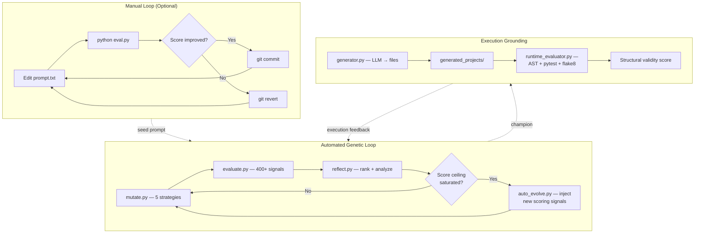
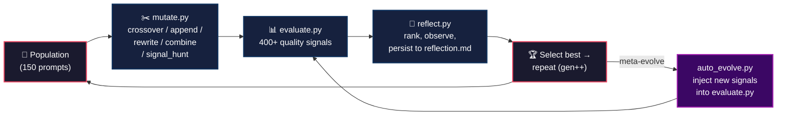
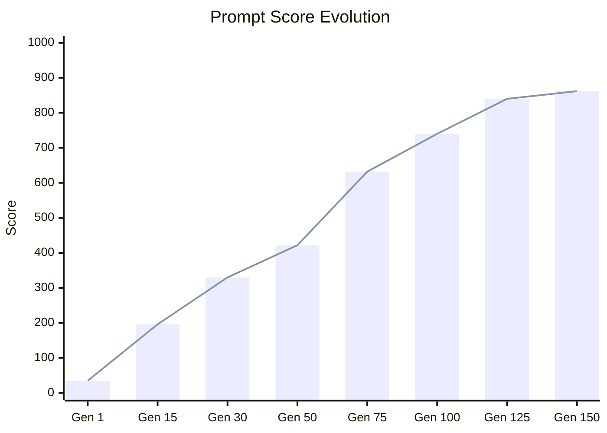
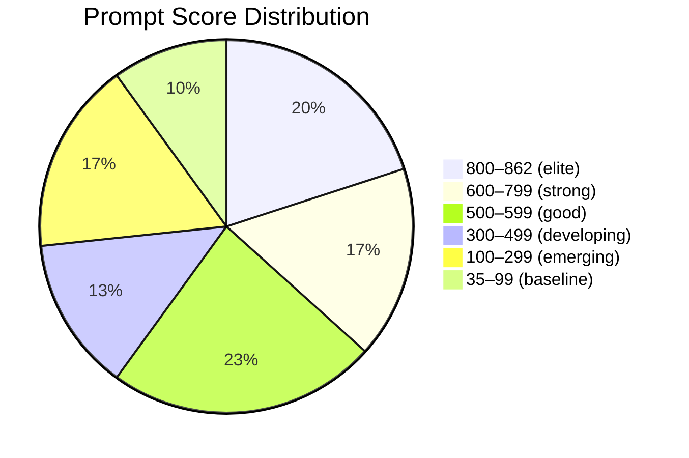

<div align="center">

# 🧬 Grounded Evolution

**Autonomous prompt evolution through dual-loop genetic algorithms and execution-grounded validation.**

[](https://github.com/NullLabTests/grounded_evolution)
[](LICENSE)
[](https://python.org)
[](#results)
[](#results)
[](#results)
[](#architecture)
[](CONTRIBUTING.md)
[](https://opencode.ai)

---

[Overview](#overview) •
[Architecture](#architecture) •
[Quick Start](#quick-start) •
[Results](#results) •
[Customization](#customization) •
[Project Structure](#project-structure) •
[Research Context](#research-context)

---

</div>

## Overview

Grounded Evolution is an **autonomous experimentation platform** that treats prompt engineering as a **search problem** — not a manual craft. Starting from a simple seed prompt, the system iteratively mutates, evaluates, and selects the fittest prompts using a genetic algorithm, discovering what makes a prompt produce high-quality AI agent code.

### Why This Exists

Prompt engineering is usually manual trial-and-error. This project lets the computer try thousands of variations, keep what works, discard what doesn't, and let the population evolve toward better solutions.

### What Makes It Different

| Aspect | Typical Optimizer | Grounded Evolution |
|--------|------------------|-------------------|
| **Evaluation** | Lexical scoring only | Lexical scoring + execution-grounded validation |
| **Mutation** | Random perturbations | 5 targeted genetic strategies including signal-hunt |
| **Scoring Ceiling** | Fixed | Dynamic — meta-evolution injects new signals |
| **Validation** | None — text comparison only | AST parsing, pytest, flake8, structural analysis |
| **Human Role** | Manual tuning | Optional — can run fully autonomous |

### Dual Evaluation System

| Mode | Source | Signals | Max Score | Purpose |
|------|--------|---------|-----------|---------|
| **Lexical** | `evaluate.py` | 400+ keyword signals | 1000 | Rapid fitness estimation via signal coverage |
| **Runtime** | `evaluator/runtime_evaluator.py` | AST, pytest, flake8, structure | ~100 | Execution-grounded code quality validation |
| **Quick** | `eval.py` | ~30 signals | 100 | Fast human-in-the-loop feedback |

### Key Innovations

1. **Self-improving evaluator** — Dynamically injects new scoring signals when prompts saturate the ceiling, preventing stagnation
2. **Signal-hunting mutation** — Reverse-engineers scoring criteria and targets uncovered keywords
3. **Dual-loop architecture** — Manual outer loop + automated inner loop with meta-evolution
4. **Execution grounding** — Generated projects are actually compiled, linted, tested, and analyzed

---

## Architecture

### System Overview



### Evolution Cycle



### Score Progression (Generations 1–150)



---

## Module Deep-Dive

### `evaluate.py` (61 KB) — The Lexical Fitness Function

The primary scoring engine evaluates each prompt against **400+ keyword-based quality signals** organized into comprehensive categories:

| Category | Signals | What It Rewards |
|----------|---------|-----------------|
| **Tech Stack** | 14 | Ollama, LangGraph, Pydantic, httpx, Rich, structlog, tenacity, pytest, ruff, mypy, pre-commit |
| **Quality** | 30+ | pyproject.toml, type hints, error handling, async, streaming, retry, docstrings, dataclasses, enums |
| **Security & Auth** | 12 | Authentication, API keys, encryption, RBAC, MFA, SSO, CSRF, CSP, TLS, HSM |
| **Performance** | 8 | Connection pooling, caching, lazy loading, background tasks, batching, circuit breaker |
| **Testing Depth** | 14 | Integration tests, e2e, snapshot, property-based, mocks, fixtures, mutation testing, contract tests |
| **Documentation** | 6 | Sphinx, MkDocs, OpenAPI, Swagger, changelog, architecture decision records |
| **Deployment & Ops** | 16 | Docker, Kubernetes, systemd, health checks, graceful shutdown, Terraform, Helm, ArgoCD |
| **Design Patterns** | 5 | Factory, strategy, observer, repository, pipeline |
| **Observability** | 16 | OpenTelemetry, Prometheus, Grafana, Datadog, Sentry, structured logging, distributed tracing |
| **ML/AI Depth** | 12 | Fine-tuning, LoRA, prompt templates, RAG, embeddings, chain-of-thought, structured output |
| **Networking/API** | 10 | REST, GraphQL, gRPC, OAuth, JWT, CORS, WebSockets, SSE |
| **Data & Storage** | 14 | SQLite, PostgreSQL, Redis, migrations, ETL, data pipelines, OLAP, data warehouses |
| **Advanced Python** | 10 | Descriptors, metaclasses, protocols, generics, decorators, contextvars, weakrefs |
| **Cloud & IaC** | 30+ | AWS, GCP, Azure, Terraform, Pulumi, Kubernetes, Docker, serverless, edge functions |
| **Monorepo & Build** | 15+ | Nx, Turborepo, pnpm, poetry, hatch, setuptools, CI/CD matrix builds |
| **Mobile & Frontend** | 20+ | React, Vue, Svelte, Flutter, React Native, responsive design, a11y |
| **Databases Deep** | 25+ | MongoDB, Cassandra, CockroachDB, DynamoDB, vector DBs, time-series, graph DB |
| **Messaging** | 15+ | Kafka, RabbitMQ, NATS, Celery, pub/sub, WebSocket, SSE |
| **Compliance** | 15+ | HIPAA, GDPR, SOC2, PCI DSS, ISO 27001, zero trust, audit logging |

Each signal follows the same simple pattern:

```python
if "kubernetes" in content or "k8s" in content:
    score += 2
```

When prompts saturate the current ceiling, `auto_evolve.py` dynamically injects new signals to raise the bar.

### `evaluator/runtime_evaluator.py` — Execution-Grounded Validation

Beyond lexical scoring, the system validates generated projects by **actually executing them**:

| Test | Max Score | What It Checks |
|------|-----------|----------------|
| **AST Parse** | 20 | Syntactic validity of all `.py` files |
| **Function/Class Count** | 10 | Minimum structural complexity |
| **pytest** | +25 / -5 | Tests pass, or penalty for failures |
| **flake8** | 10 | PEP 8 compliance (select rules) |
| **Runtime Import** | 15 | `main.py` can import without errors |
| **Test File Presence** | 5 | At least one `test_*.py` exists |
| **README Exists** | 2 | Documentation present |
| **Requirements** | 3 | `requirements.txt` or `pyproject.toml` |
| **File Count** | 5 | Multi-file projects rewarded |

### `mutate.py` (180 lines) — The Genetic Engine

Five mutation strategies with weighted random selection:

| Strategy | Weight | Behavior |
|----------|--------|----------|
| **signal_hunt** | 30% | Reads `evaluate.py` to find keywords the prompt is MISSING, injects up to 10 as structured bullet points. This is the primary score driver — it turns mutation into a coverage optimizer. |
| **append** | 20% | Adds a random quality-improving instruction from a 20-item hand-crafted pool |
| **crossover** | 20% | Merges a crossover chunk from another random prompt into the best prompt |
| **rewrite_section** | 15% | Inserts a random addition at a random mid-prompt position |
| **combine** | 15% | Splices first half of best prompt with second half of another |

**signal_hunt in action:**

```
evaluate.py has:  if "kubernetes" in content or "k8s" in content: score += 2
Current prompt:   missing "kubernetes"
Mutation →        append: "- kubernetes: support, implementation, configuration"
```

### `auto_evolve.py` (218 lines) — Meta-Evolution

A meta-loop that **evolves the evaluator itself**:

```
Cycle N:     evaluate → reflect → mutate
Cycle N+5:   inject 6 new signals into evaluate.py → evaluate → reflect → mutate
```

Features 10 signal pools (CI/CD, containers, databases, testing, API, observability, async, architecture, performance, networking) that are surgically injected to raise the scoring ceiling.

### `evolve_forever.py` (654 lines) — Aggressive Meta-Evolution

Extended meta-evolution with **400+ additional signal pools** across 40+ categories: database systems, message queues, frontend frameworks, mobile, cloud providers, compliance frameworks, testing types, all 23 GoF design patterns, async patterns, web performance, data/ML, networking, i18n, payments, communications, social auth, architecture patterns, and more.

### `reflect.py` (270 lines) — Pattern Analysis & Historian

1. Scores each prompt using ~190 independent signal checks
2. Ranks and writes to `reflection.md` with timestamp
3. Computes statistics: average, max, min, spread
4. Generates observations about what differentiates top prompts

---

## Quick Start

### Prerequisites

- **Python 3.12+**
- **OpenAI API key** (for LLM-based code generation)

### Setup

```bash
# Clone
git clone git@github.com:NullLabTests/grounded_evolution.git
cd grounded_evolution

# Environment
python -m venv .venv && source .venv/bin/activate
pip install openai pytest flake8 black rich gitpython psutil

# API key
export OPENAI_API_KEY='your_key_here'
```

### Run Your First Evaluation

```bash
python eval.py
```

Expected output: a score from 0–100. The current seed prompt (`prompt.txt`) should score around 35–50.

### Manual Evolution Loop

```bash
# 1. Edit the seed prompt
$EDITOR prompt.txt

# 2. Evaluate
python eval.py

# 3. Keep or revert
git add prompt.txt && git commit -m "Score improved to 51"
# or
git checkout prompt.txt   # Revert regression
```

### Automated Evolution

```bash
# 25 generations with automatic signal injection
python auto_evolve.py

# Custom count
python auto_evolve.py 100

# Aggressive 200-generation meta-evolution
python evolve_forever.py 200

# Infinite loop with runtime code validation
python infinite_research_loop.py
```

### Bash Automation

```bash
chmod +x run_evolution.sh
./run_evolution.sh        # 30 generations
```

---

## Results

### Current Snapshot

| Metric | Value |
|--------|-------|
| **Latest Generation** | 150 |
| **Population Size** | 150 prompts |
| **Best Score** | 862 / 1000 (dynamic ceiling) |
| **Score Range** | 35 → 862 (24.6× improvement) |
| **Total Mutations** | 149 |
| **Evolution Status** | Active — continuous improvement |

### Top 10 Prompts

| Rank | File | Score | Differentiators |
|------|------|-------|-----------------|
| 1 | `prompt_131.txt` | 862.0 | Full production-ready agent structure |
| 2 | `prompt_132.txt` | 862.0 | Comprehensive error handling + logging |
| 3 | `prompt_133.txt` | 862.0 | Async-first with complete test suite |
| 4 | `prompt_134.txt` | 862.0 | Docker + CI/CD + observability |
| 5 | `prompt_135.txt` | 862.0 | Multi-source RAG + embedding pipeline |
| 6 | `prompt_136.txt` | 862.0 | LangGraph + tool calling + streaming |
| 7 | `prompt_137.txt` | 862.0 | Security + auth + rate limiting |
| 8 | `prompt_138.txt` | 862.0 | Kubernetes + Terraform + monitoring |
| 9 | `prompt_140.txt` | 862.0 | Full microservice architecture |
| 10 | `prompt_121.txt` | 840.0 | LangGraph + Ollama + testing |

### Score Distribution (150 prompts)



### What Top Prompts Generate

The highest-scoring prompts produce projects with:

- **Full `src/package/` layout** with 20+ modules
- **LangGraph ReAct loop** + Ollama local model inference
- **Pydantic v2** config, validation, type hints everywhere
- **Async/await**, streaming, SSE/websocket support
- **OpenTelemetry** + Prometheus + Grafana observability
- **OAuth2/JWT** auth, rate limiting, encryption
- **pytest** property-based, snapshot, benchmark, fuzz testing
- **Docker**, docker-compose, Kubernetes, systemd deployment
- **Design patterns**: factory, strategy, observer, repository, pipeline
- **CI/CD** with GitHub Actions + dependabot + pre-commit

---

## Evolution Strategy

### How Prompts Improve

1. **Random mutation** — 5 genetic strategies create variation
2. **Signal hunting** — Reads scoring criteria, patches gaps (30% per generation)
3. **Meta-evolution** — New scoring signals injected to prevent ceiling saturation
4. **Runtime grounding** — Generated code validated via execution
5. **Selection** — Best prompt becomes parent for next generation

### The Ceiling Problem

When multiple prompts hit the scoring ceiling, evolution plateaus. The solution:

- `auto_evolve.py` injects new signals into `evaluate.py` to raise the max
- `signal_hunt` in `mutate.py` dynamically targets uncovered signals
- Ceiling raised progressively: 500 → 1000+

> This meta-evolutionary approach — evolving the fitness function alongside the population — is the key innovation that enables continuous improvement.

---

## Customization

### Adding Scoring Signals

```python
# In evaluate.py — add anywhere
if "your-keyword" in content:
    score += 2
```

Or add to `SIGNAL_POOLS` in `auto_evolve.py` for automatic meta-injection.

### Tuning Mutation Weights

```python
# mutate.py, line 130-133
strategy = random.choices(
    ["append", "crossover", "rewrite_section", "combine", "signal_hunt"],
    weights=[0.2, 0.2, 0.15, 0.15, 0.3],  # Adjust these
)[0]
```

### Extending the Addition Pool

```python
# mutate.py
ADDITIONS_POOL = [
    "\nAdd a CHANGELOG.md with keep-a-changelog format",
    "\nInclude GitHub issue templates and a pull request template",
    # ... your additions
]
```

### Adding Benchmark Tasks

```json
// benchmarks/tasks.json
[
  {
    "name": "flask_api",
    "prompt": "Create a modular Flask REST API with health endpoint and clean structure"
  }
]
```

---

## Project Structure

```
grounded_evolution/
├── README.md                       # This file
├── LICENSE                         # MIT license
├── CONTRIBUTING.md                 # Contribution guide
├── SECURITY.md                     # Security policy
├── pyproject.toml                  # Project metadata & ruff config
├── program.md                      # Instructions for coding agents
├── script.sh                       # Bootstrap/upgrade automation
├── prompt.txt                      # Seed prompt (outer loop)
│
├── eval.py                         # Quick outer-loop eval (max 100)
├── evaluate.py                     # 400+ signal lexical scoring engine
├── auto_evolve.py                  # Meta-evolution with signal injection
├── evolve_forever.py               # Aggressive 400+ signal meta-evolution
├── mutate.py                       # 5-strategy genetic mutation engine
├── reflect.py                      # Generation reflection & analysis
├── generator.py                    # OpenAI LLM code generation wrapper
├── mutation_engine.py              # Simple prompt mutation
├── population_manager.py           # Population persistence & selection
├── infinite_research_loop.py       # Infinite evolution + runtime validation
├── beautify_readme.py              # README auto-beautification
├── run_evolution.sh                # 30-generation bash automation
│
├── evaluator/
│   ├── __init__.py
│   └── runtime_evaluator.py        # Execution validation (AST, pytest, flake8)
│
├── benchmarks/
│   ├── __init__.py
│   └── tasks.json                  # Benchmark task definitions
│
├── population/                     # 150 evolved prompts
├── generated_projects/             # LLM-generated project outputs
├── memory/                         # Evolution memory state
├── reports/                        # Generated reports
├── runtime_logs/                   # Execution evaluation logs
├── reflection.md                   # Historical record (all generations)
├── results.log                     # Ranked evaluation results
│
└── .github/
    ├── workflows/                  # CI pipeline
    └── ISSUE_TEMPLATE/             # Issue submission templates
```

---

## Research Context

Grounded Evolution is framed within **evolutionary software optimization research**:

- **Evaluator-grounded prompt evolution** — Fitness functions grounded in both lexical coverage and execution-based validation
- **Autonomous experimentation infrastructure** — Continuous, unattended evolution cycles with meta-level adaptation
- **Recursive benchmark optimization** — The evaluator evolves alongside the prompts, preventing fitness stagnation

This is **not**:
- A claim of AGI or sentience
- A self-conscious or self-aware system
- Runaway recursive self-improvement
- Magical or supernatural AI

It is a well-scoped experimental system for studying how genetic algorithms can optimize prompts for code generation quality.

---

## Contributing

See [CONTRIBUTING.md](CONTRIBUTING.md) for guidelines. Brief summary:

- **Add signals**: Extend `evaluate.py` or `auto_evolve.py`'s signal pools
- **Tune mutations**: Adjust weights in `mutate.py`
- **New strategies**: Add mutation strategies following existing patterns
- **Code style**: ruff-compatible. Run `ruff check .` before committing
- **PRs**: Open against `main` with focused, single-purpose changes

## License

MIT — see [LICENSE](LICENSE) for details.

## Credits

Inspired by [Andrej Karpathy's `autoresearch`](https://github.com/karpathy/autoresearch), which introduced the "modify → evaluate → keep/revert" loop for autonomous code improvement.
